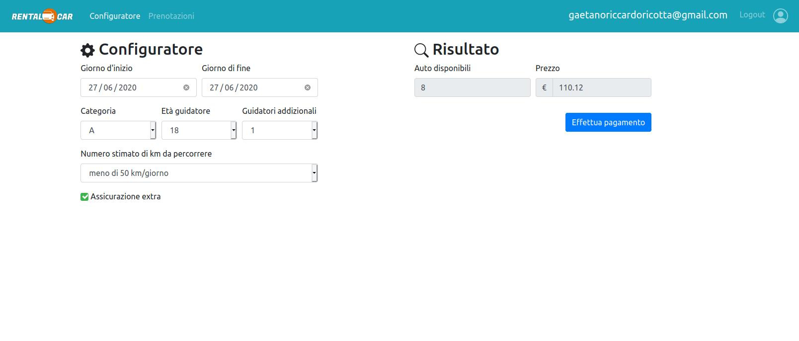

# Exam #1: "Noleggio Veicoli"
## Student: s276937 RICOTTA GAETANO RICCARDO 

## React client application routes

- Route `/`: page showing all available cars with the possibility to filter them
- Route `/login`: login page
- Route `/config`: configurator page
- Route `/bookings`: page showing all the past and future user's bookings

## REST API server

- POST `api/login`
  - request body: object containing user's credentials
  - response body: { id: user.userID, email: user.email }
- GET `/api/cars`
  - request body: empty
  - response body: cars list
- GET `/api/brands`
  - request body: empty
  - response body: brands list
- GET `/api/categories`
  - request body: empty
  - response body: categories list
- GET `/api/user`
  - request body: empty
  - response body: { id: user.userID, email: user.email }
- POST `api/checkPrice`
  - request body: object containing rental's informations
  - response body: { carsNumber: numbers.carsNumber, price: price, selectedCarID: numbers.selectedCarID }
- GET `/api/bookings`
  - request body: empty
  - response body: user's bookings list
- POST `api/payment`
  - request body: object containing user's payment information
  - response body: "OK"
- POST `api/bookings`
  - request body: object containing user's booking information
  - response body: rental ID
- DELETE `api/bookings/rentalID`
  - request parameters: rental ID
  - response body: empty

## Server database

- Table `USER` - contains userID email password
- Table `CAR` - contains carID brand model category
- Table `RENTAL` - contains rentalID userID carID startDate endDate price

## Main React Components
all components are placed in ./client/src/components

- `Filters` (in `Filters.js`): component used to implement the filtering functionality
- `GridItem` (in `GridItem.js`): component used to show a car in the Grid on the main page
- `Config` (in `Config.js`): component used to implement the configurator and interactive calculation of the rental price
- `ConfigForm` (in `ConfigForm.js`): component used to implement the configurator
- `ResultInfo` (in `ResultInfo.js`): component used to show the amount of avalaible cars and rental price
- `PaymentForm` (in `PaymentForm.js`): component used to implement the payment functionality
- `BookingHistory` (in `BookingHistory.js`): component used to show the past and future rentals of the logged user
- `ConfirmModal` (in `ConfirmModal.js`): component used to confirm the elimination of a rental

## Screenshot

## Test users

* gaetanoriccardoricotta@gmail.com, qwerty123 (frequent customer)
* mario.rossi@gmail.com, qazwsxedc
* alessia.ric98@gmail.com, flubber
* stefano.frollini@gmail.com, tastiera
* costanza_palombelli@yahoo.it, palombelli
